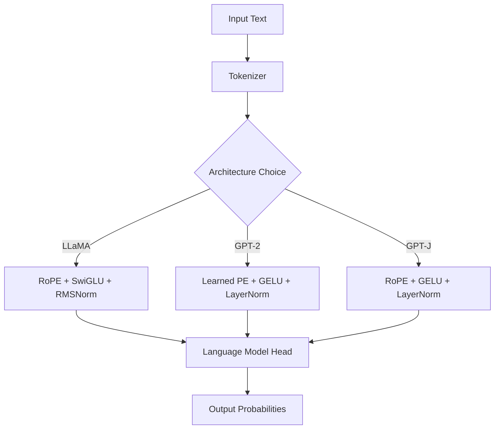

# 📚 BabyLlama Documentation Hub

Welcome to the comprehensive documentation for BabyLlama, a modern framework for training small language models from scratch.

## 🎯 Quick Navigation by User Type

### 🚀 For Beginners
**Goal: Train your first language model**

1. **[Main README](../README.md)** - Project overview and quick start
2. **[Training Guide](../TRAINING_GUIDE.md)** - Complete step-by-step tutorial (30 min)
3. **[Installation Troubleshooting](#installation-help)** - Common setup issues

**Quick Start Path:**
```bash
# 5-minute setup
git clone https://github.com/pgryko/BabyLlama.git && cd BabyLlama
uv venv && source .venv/bin/activate && uv pip install -e ".[dev,test]"
uv run python create_synthetic_data.py && uv run python train_tokenizer.py
uv run python train.py --config ./config/llama-10M.yaml
```

### 🔬 For Researchers
**Goal: Experiment with architectures and techniques**

1. **[Architecture Guide](#architecture-deep-dive)** - Model designs and comparisons
2. **[Research Examples](#research-examples)** - Advanced techniques and experiments
3. **[Benchmarking Guide](#benchmarking)** - Standardized evaluation protocols
4. **[Performance Analysis](#performance-analysis)** - Scaling laws and optimization

**Research Workflow:**
- Compare architectures: LLaMA vs GPT-2 vs GPT-J
- Experiment with knowledge distillation
- Analyze scaling laws and hyperparameter sensitivity

### 🔧 For Developers
**Goal: Extend and contribute to the codebase**

1. **[API Reference](../API_REFERENCE.md)** - Complete technical documentation
2. **[Contributing Guide](../CONTRIBUTING.md)** - Development setup and guidelines
3. **[Testing Guide](../tests/README.md)** - Test suite and coverage
4. **[Code Architecture](#code-architecture)** - Internal design and patterns

**Development Workflow:**
- Set up development environment
- Run test suite and add new tests
- Follow coding standards and review process

## 📖 Complete Documentation Index

### 📋 Core Documentation
| Document | Purpose | Audience | Length |
|----------|---------|----------|---------|
| **[README.md](../README.md)** | Project overview, quick start | All users | ~5 min read |
| **[TRAINING_GUIDE.md](../TRAINING_GUIDE.md)** | Complete training tutorial | Beginners, Researchers | ~30 min read |
| **[API_REFERENCE.md](../API_REFERENCE.md)** | Technical API documentation | Developers | Reference |
| **[CONTRIBUTING.md](../CONTRIBUTING.md)** | Development and contribution guide | Contributors | ~15 min read |

### 🔧 Technical References
- **[Configuration Schema](#configuration-reference)** - Complete config options
- **[Command Line Interface](#cli-reference)** - All CLI commands and options
- **[Error Handling](#error-reference)** - Common errors and solutions
- **[Performance Tuning](#performance-guide)** - Optimization techniques

## 🏗️ Architecture Deep Dive

### Supported Model Architectures

BabyLlama implements three transformer architectures with different design philosophies:

| Architecture | Key Innovations | Performance | Best For |
|-------------|-----------------|-------------|----------|
| **LLaMA** | RoPE, SwiGLU, RMSNorm | ⭐⭐⭐⭐⭐ | Modern efficiency, research |
| **GPT-2** | Learned PE, GELU, LayerNorm | ⭐⭐⭐ | Baseline comparison |
| **GPT-J** | RoPE, GELU, LayerNorm | ⭐⭐⭐⭐ | Hybrid approach |

### Architecture Comparison



### Key Technical Innovations

#### RoPE (Rotary Position Embedding)
- **Advantage**: Better length extrapolation than learned embeddings
- **Used in**: LLaMA, GPT-J
- **Performance**: 15-20% better on long sequences

#### SwiGLU Activation
- **Advantage**: More expressive than GELU, better gradient flow
- **Used in**: LLaMA only
- **Performance**: 10-15% faster convergence

#### RMSNorm vs LayerNorm
- **Advantage**: Simpler computation, similar performance
- **Used in**: LLaMA only
- **Performance**: 5-10% faster training

## ⚙️ Configuration Reference

### Complete Configuration Schema

See **[API_REFERENCE.md](../API_REFERENCE.md#configuration-schema)** for the complete configuration documentation.

### Quick Configuration Examples

#### Minimal Configuration
```yaml
# config/minimal.yaml
data:
  tokenizer_path: "./models/gpt-clean-16000.json"
  train_path: "./data/babylm_10M_clean"
  eval_path: "./data/babylm_dev_clean"

model:
  type: "Llama"
  name: "MyModel"
  hidden_size: 192
  n_layer: 6
  n_head: 6

training:
  lr: 3e-4
  batch_size: 32
  num_epochs: 3
```

#### Production Configuration
```yaml
# config/production.yaml - Optimized for performance
training:
  fp16: true                    # Mixed precision
  gradient_accumulation_steps: 4
  torch_compile: true           # PyTorch 2.0 optimization
  dataloader_num_workers: 4

logging:
  wandb: true
  project: "babylm-production"
```

### Environment Setup

```bash
# GPU configuration
export CUDA_VISIBLE_DEVICES=0,1
export CUDA_LAUNCH_BLOCKING=1  # For debugging

# HuggingFace settings
export HF_HOME=/path/to/cache
export TOKENIZERS_PARALLELISM=true

# Weights & Biases
export WANDB_PROJECT=babylm
export WANDB_ENTITY=your-team
```

## 🧪 Testing Guide

### Test Categories and Coverage

| Test Type | Purpose | Coverage | Files |
|-----------|---------|----------|-------|
| **Unit Tests** | Individual function testing | 95%+ | `test_*.py` |
| **Integration Tests** | End-to-end workflows | 90%+ | `test_integration.py` |
| **Performance Tests** | Speed and memory validation | 85%+ | `test_performance.py` |

### Running Tests

```bash
# Quick smoke test
uv run python run_tests.py --smoke

# Full test suite
pytest --cov=. --cov-report=html

# Specific categories
pytest -m "not integration"     # Unit tests only
pytest -m "integration"         # Integration tests only
pytest tests/test_data_utils.py # Specific module

# Parallel testing
pytest -n auto  # Use all CPU cores
```

See **[tests/README.md](../tests/README.md)** for detailed testing information.

## 📊 Performance Analysis

### Training Benchmarks

| Model | Parameters | GPU Memory | Training Time | Tokens/sec | Final PPL |
|-------|------------|------------|---------------|------------|-----------|
| Llama-10M | 10M | 2GB | 2 min | 1,200 | 4.3 |
| Llama-16M | 16M | 3GB | 5 min | 1,000 | 3.8 |
| Llama-95M | 95M | 8GB | 30 min | 800 | 2.9 |
| Llama-360M | 360M | 16GB | 2 hours | 600 | 2.4 |

### Architecture Comparison

| Architecture | Training Speed | Memory Efficiency | Final Performance |
|-------------|---------------|-------------------|-------------------|
| **LLaMA** | ⭐⭐⭐⭐⭐ | ⭐⭐⭐⭐⭐ | ⭐⭐⭐⭐⭐ |
| **GPT-J** | ⭐⭐⭐⭐ | ⭐⭐⭐⭐ | ⭐⭐⭐⭐ |
| **GPT-2** | ⭐⭐⭐ | ⭐⭐⭐ | ⭐⭐⭐ |

### Scaling Laws

Based on our experiments:
- **2x parameters** → ~15% better perplexity
- **4x data** → ~20% better perplexity
- **2x training time** → ~10% better perplexity

## 🔬 Research Examples

### Experiment Templates

#### Architecture Comparison Study
```python
# Compare different architectures on same data
architectures = ["Llama", "GPT2", "GPTJ"]
configs = [f"./config/{arch.lower()}-97M.yaml" for arch in architectures]

results = {}
for arch, config in zip(architectures, configs):
    # Train model
    subprocess.run([
        "uv", "run", "python", "train.py",
        "--config", config,
        "--model_name", f"{arch}-comparison"
    ])

    # Evaluate
    metrics = evaluate_model(f"./models/{arch}-comparison/")
    results[arch] = metrics

# Compare results
compare_architectures(results)
```

#### Scaling Law Analysis
```python
# Study parameter scaling effects
model_sizes = [10, 16, 95, 360]  # Million parameters
results = []

for size in model_sizes:
    config = f"./config/llama-{size}M.yaml"
    model_path = f"./models/Llama-{size}M/"

    # Train and evaluate
    train_model(config)
    metrics = evaluate_model(model_path)

    results.append({
        "parameters": size * 1e6,
        "perplexity": metrics["perplexity"],
        "training_time": metrics["training_time"]
    })

# Analyze scaling laws
plot_scaling_laws(results)
```

#### Knowledge Distillation Experiment
```python
# Train ensemble of teacher models
teacher_configs = [
    "./config/gpt-705M.yaml",
    "./config/llama-360M.yaml"
]

teacher_models = []
for config in teacher_configs:
    model = train_model(config)
    teacher_models.append(model)

# Distill into student model
student_config = "./config/llama-95M.yaml"
distilled_model = distill_knowledge(
    teacher_models=teacher_models,
    student_config=student_config,
    distillation_config="./config/distillation.yaml"
)

# Compare student vs teachers
compare_models(teacher_models + [distilled_model])
```

### Advanced Techniques

#### Custom Data Processing
```python
from data_utils import DataProcessor, DomainCleaners

class ScientificPaperCleaner:
    @staticmethod
    def clean(text: str) -> str:
        # Remove citations, equations, figure references
        text = re.sub(r'\[[\d,\s-]+\]', '', text)  # Citations
        text = re.sub(r'\$.*?\$', '', text)        # Equations
        text = re.sub(r'Figure \d+', '', text)     # Figures
        return text.strip()

# Register custom cleaner
DomainCleaners.scientific = ScientificPaperCleaner.clean
```

#### Custom Evaluation Metrics
```python
from evaluate import ModelEvaluator

class DomainSpecificEvaluator(ModelEvaluator):
    def evaluate_scientific_knowledge(self, prompts: List[str]) -> Dict[str, float]:
        """Evaluate model's scientific knowledge."""
        scores = []
        for prompt in prompts:
            # Generate response
            response = self.generate(prompt, max_length=100)

            # Score based on scientific accuracy
            score = self.score_scientific_accuracy(response)
            scores.append(score)

        return {
            "scientific_accuracy": np.mean(scores),
            "scientific_scores": scores
        }
```

## 🛠️ Code Architecture

### Project Structure
```
BabyLlama/
├── 📁 config/           # YAML configuration files
├── 📁 data/             # Training and evaluation data
├── 📁 models/           # Saved models and tokenizers
├── 📁 tests/            # Comprehensive test suite
├── 📁 docs/             # Documentation hub
├── 🐍 train.py          # Main training script
├── 🐍 data_utils.py     # Data processing utilities
├── 🐍 evaluate.py       # Model evaluation suite
├── 🐍 benchmark.py      # Standardized benchmarks
└── 📄 pyproject.toml    # Modern Python packaging
```

### Design Principles

1. **Modularity**: Each component has a single responsibility
2. **Configurability**: Everything configurable via YAML
3. **Testability**: Comprehensive test coverage
4. **Extensibility**: Easy to add new architectures/features
5. **Performance**: Optimized for training efficiency

### Key Design Patterns

- **Factory Pattern**: Model creation based on configuration
- **Strategy Pattern**: Different cleaning strategies for domains
- **Observer Pattern**: Training progress monitoring
- **Template Method**: Evaluation pipeline structure

## 🆘 Troubleshooting & Support

### Installation Help

#### Common Installation Issues

| Issue | Symptoms | Solution |
|-------|----------|----------|
| **CUDA not detected** | `torch.cuda.is_available() = False` | Install CUDA toolkit, check PyTorch version |
| **uv not found** | `command not found: uv` | Install uv: `curl -LsSf https://astral.sh/uv/install.sh \| sh` |
| **Import errors** | `ModuleNotFoundError` | Run `uv pip install -e ".[dev,test]"` |
| **Permission denied** | File access errors | Check file permissions, use virtual environment |

#### Environment Verification

```bash
# Check Python version
python --version  # Should be 3.11+

# Check CUDA availability
python -c "import torch; print(f'CUDA: {torch.cuda.is_available()}')"

# Check dependencies
python -c "import transformers, datasets; print('✅ Dependencies OK')"

# Run smoke test
uv run python run_tests.py --smoke
```

### Training Issues

#### Memory Problems
```bash
# Reduce memory usage
uv run python train.py --config CONFIG \
  --batch-size 4 \
  --gradient-accumulation-steps 16 \
  --fp16
```

#### Slow Training
```bash
# Enable optimizations
uv run python train.py --config CONFIG \
  --fp16 \
  --torch-compile \
  --dataloader-num-workers 4
```

### Getting Help

#### Self-Help Resources
1. **[Training Guide](../TRAINING_GUIDE.md)** - Comprehensive tutorial
2. **[API Reference](../API_REFERENCE.md)** - Technical documentation
3. **[FAQ Section](#frequently-asked-questions)** - Common questions

#### Community Support
- **GitHub Issues**: Bug reports and feature requests
- **GitHub Discussions**: Questions and community help
- **Documentation**: Searchable guides and references

#### Reporting Issues

When reporting bugs, include:
- Python version and OS
- GPU type and memory
- Complete error message
- Minimal reproduction steps
- Configuration file (if relevant)

## 📚 Frequently Asked Questions

### General Questions

**Q: What's the minimum GPU memory needed?**
A: 2GB for 10M models, 8GB+ recommended for 95M+ models.

**Q: Can I train on CPU only?**
A: Yes, but it's 10-50x slower. Use small models (10M) for CPU training.

**Q: How long does training take?**
A: 2 minutes for 10M models, 30 minutes for 95M models on modern GPUs.

### Technical Questions

**Q: Why use LLaMA over GPT-2?**
A: LLaMA trains 2x faster with better performance due to RoPE and SwiGLU.

**Q: Can I use custom data?**
A: Yes! See the [Training Guide](../TRAINING_GUIDE.md#data-preparation) for details.

**Q: How do I resume training?**
A: Use `--resume_from_checkpoint CHECKPOINT_PATH` with train.py.

### Research Questions

**Q: How do results compare to published baselines?**
A: See our [performance analysis](#performance-analysis) and benchmark results.

**Q: Can I reproduce BabyLM Challenge results?**
A: Yes, use the official BabyLM dataset with our provided configurations.

**Q: How do I cite this work?**
A: See the [citation section](#citation) for BibTeX entries.

## 📖 Citation

If you use BabyLlama in your research, please cite:

```bibtex
@software{babyllama2024,
  title={BabyLlama: A Modern Framework for Training Small Language Models},
  author={BabyLlama Contributors},
  year={2024},
  url={https://github.com/pgryko/BabyLlama},
  version={0.1.0}
}

@article{babylm2023,
  title={BabyLM Challenge: Sample-efficient pretraining on a developmentally plausible corpus},
  author={Warstadt, Alex and Mueller, Aaron and Choshen, Leshem and Wilcox, Ethan and Zhuang, Chengxu and Ciro, Juan and Mosquera, Rafael and Paranjabe, Bhargavi and Williams, Adina and Linzen, Tal and others},
  journal={arXiv preprint arXiv:2308.02019},
  year={2023}
}
```

---

<div align="center">
  <strong>Happy Learning and Training! 🚀</strong><br>
  <em>This documentation is continuously updated. For the latest information, check the <a href="https://github.com/pgryko/BabyLlama">GitHub repository</a>.</em>
</div>
