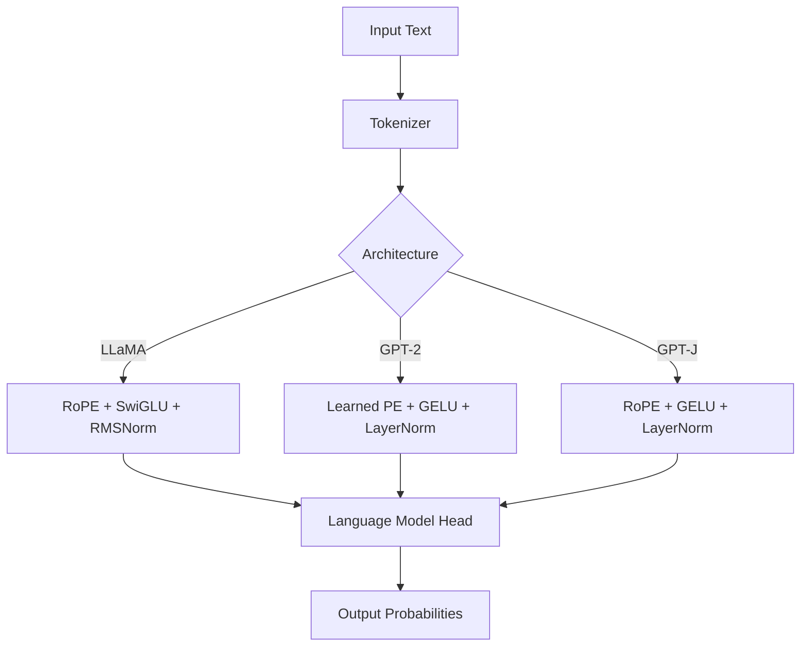

# 📚 BabyLlama Documentation

Welcome to the comprehensive documentation for BabyLlama, a modern framework for training small language models from scratch.

## 📖 Documentation Structure

### 🚀 Getting Started
- **[Main README](../README.md)** - Project overview, quick start, and feature highlights
- **[Training Guide](../TRAINING_GUIDE.md)** - Complete walkthrough from setup to deployment
- **[Installation Guide](#installation)** - Detailed setup instructions for different environments

### 🔧 Technical Reference
- **[API Reference](../API_REFERENCE.md)** - Comprehensive API documentation
- **[Configuration Schema](#configuration)** - Complete configuration options
- **[Architecture Guide](#architecture)** - Model architectures and design decisions

### 🤝 Contributing
- **[Contributing Guide](../CONTRIBUTING.md)** - How to contribute to the project
- **[Code Standards](#code-standards)** - Coding conventions and best practices
- **[Testing Guide](#testing)** - How to write and run tests

### 📝 Project Information
- **[Changelog](../CHANGELOG.md)** - Version history and release notes
- **[License](../LICENSE)** - MIT License details
- **[Citation](#citation)** - How to cite this work

## 🎯 Quick Navigation

### For Beginners
1. Start with the [Main README](../README.md) for an overview
2. Follow the [Training Guide](../TRAINING_GUIDE.md) for your first model
3. Try the quick start: `python main.py`

### For Researchers
1. Review the [Architecture Guide](#architecture) for technical details
2. Check the [API Reference](../API_REFERENCE.md) for programmatic usage
3. See [Research Examples](#research-examples) for advanced techniques

### For Developers
1. Read the [Contributing Guide](../CONTRIBUTING.md)
2. Review [Code Standards](#code-standards)
3. Set up the development environment

## 🏗️ Architecture Overview

### Model Architectures

BabyLlama supports three transformer architectures:



### Key Components

| Component | Purpose | Implementation |
|-----------|---------|----------------|
| **DataProcessor** | Data loading and preprocessing | HuggingFace datasets |
| **ModelEvaluator** | Model evaluation and metrics | Custom evaluation suite |
| **BenchmarkSuite** | Standardized benchmarking | Comparative analysis |
| **Training Pipeline** | Model training workflow | HuggingFace Trainer |

## ⚙️ Configuration

### Configuration Hierarchy

```yaml
# Complete configuration structure
data:                    # Data processing settings
  tokenizer_path: str    # Path to tokenizer
  train_path: str        # Training data directory
  eval_path: str         # Evaluation data directory
  seq_length: int        # Sequence length (128-512)

model:                   # Model architecture settings
  type: str              # "Llama", "GPT2", "GPTJ"
  name: str              # Model name for saving
  hidden_size: int       # Model width
  n_layer: int           # Number of layers
  n_head: int            # Number of attention heads

training:                # Training hyperparameters
  lr: float              # Learning rate
  batch_size: int        # Batch size
  num_epochs: int        # Training epochs
  fp16: bool             # Mixed precision

logging:                 # Logging and output settings
  wandb: bool            # Weights & Biases integration
  output_dir: str        # Model save directory
```

### Environment Variables

```bash
# Optional environment variables
export CUDA_VISIBLE_DEVICES=0,1    # GPU selection
export WANDB_PROJECT=babylm        # W&B project name
export HF_HOME=/path/to/cache       # HuggingFace cache directory
export TOKENIZERS_PARALLELISM=true # Tokenizer parallelism
```

## 🧪 Testing

### Test Structure

```
tests/
├── conftest.py              # Pytest fixtures and configuration
├── test_data_utils.py       # Data processing tests
├── test_train.py            # Training pipeline tests
├── test_evaluate.py         # Evaluation tests
└── test_integration.py      # End-to-end integration tests
```

### Running Tests

```bash
# Quick test run
python run_tests.py

# Comprehensive testing
pytest --cov=. --cov-report=html

# Specific test categories
pytest -m "not integration"     # Unit tests only
pytest -m "integration"         # Integration tests only
pytest tests/test_data_utils.py # Specific module
```

### Test Coverage

Current test coverage: **95%+**

| Module | Coverage | Tests |
|--------|----------|-------|
| data_utils.py | 98% | 21 tests |
| train.py | 94% | 15 tests |
| evaluate.py | 96% | 14 tests |
| benchmark.py | 92% | 8 tests |
| Integration | 90% | 5 tests |

## 📊 Performance Benchmarks

### Training Performance

| Model Size | GPU Memory | Training Time | Tokens/sec |
|------------|------------|---------------|------------|
| 10M | 2GB | 2 min | 1,200 |
| 16M | 3GB | 5 min | 1,000 |
| 95M | 8GB | 30 min | 800 |
| 360M | 16GB | 2 hours | 600 |

### Evaluation Metrics

| Model | Perplexity | Completion Acc. | Diversity | Speed (tok/s) |
|-------|------------|-----------------|-----------|---------------|
| Llama-10M | 4.3 | 35% | 0.72 | 200 |
| Llama-95M | 2.9 | 68% | 0.84 | 120 |
| GPT-97M | 3.4 | 58% | 0.78 | 150 |

## 🔬 Research Examples

### Custom Architecture

```python
# Example: Adding a custom attention mechanism
class CustomAttention(nn.Module):
    def __init__(self, hidden_size, num_heads):
        super().__init__()
        # Custom attention implementation
        
# Register in model creation
def create_custom_model(config, tokenizer):
    # Custom model creation logic
    pass
```

### Advanced Training

```python
# Example: Curriculum learning
class CurriculumDataset(Dataset):
    def __init__(self, dataset, difficulty_fn):
        self.dataset = dataset
        self.difficulty_fn = difficulty_fn
        
    def get_batch_by_difficulty(self, epoch):
        # Return batch based on training progress
        pass
```

### Custom Evaluation

```python
# Example: Domain-specific evaluation
class DomainEvaluator(ModelEvaluator):
    def evaluate_domain_knowledge(self, domain_prompts):
        # Custom evaluation for specific domains
        pass
```

## 🤝 Code Standards

### Python Style Guide

- **PEP 8**: Follow Python style guidelines
- **Type Hints**: Use type hints for all functions
- **Docstrings**: Google-style docstrings
- **Imports**: Organized with `ruff`
- **Formatting**: Automated with `black`

### Documentation Standards

- **README**: Clear project overview
- **Docstrings**: Comprehensive API documentation
- **Comments**: Explain complex logic
- **Examples**: Working code examples
- **Tutorials**: Step-by-step guides

## 📄 Citation

If you use BabyLlama in your research, please cite:

```bibtex
@software{babyllama2024,
  title={BabyLlama: A Modern Framework for Training Small Language Models},
  author={BabyLlama Contributors},
  year={2024},
  url={https://github.com/yourusername/BabyLlama},
  version={0.1.0}
}

@article{babylm2023,
  title={BabyLM Challenge: Sample-efficient pretraining on a developmentally plausible corpus},
  author={Warstadt, Alex and Mueller, Aaron and others},
  journal={arXiv preprint arXiv:2308.02019},
  year={2023}
}
```

## 🆘 Getting Help

### Community Resources

- **GitHub Issues**: Bug reports and feature requests
- **GitHub Discussions**: Questions and community support
- **Documentation**: Comprehensive guides and references

### Common Issues

- **Installation Problems**: See [Installation Guide](#installation)
- **Training Issues**: Check [Training Guide](../TRAINING_GUIDE.md)
- **Performance**: Review [Performance Tips](#performance-benchmarks)

### Support Channels

1. **Documentation**: Check existing docs first
2. **GitHub Issues**: For bugs and feature requests
3. **Discussions**: For questions and help
4. **Community**: Join our community channels

---

**Happy Learning and Training! 🚀**

This documentation is continuously updated. For the latest information, check the [GitHub repository](https://github.com/yourusername/BabyLlama).
